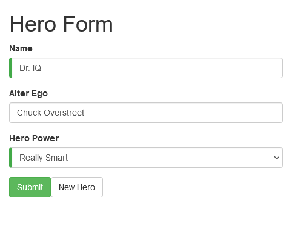
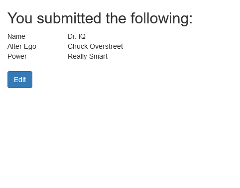
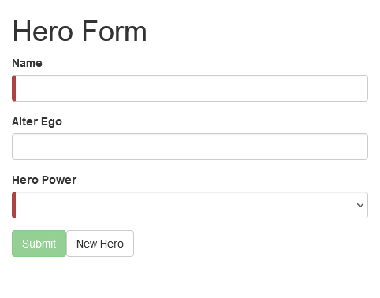

<p align="center">
  
</p>

<h1 align="center">Building a template driven form angular</h1>
<p align="center">Building a template-driven form. Done in one of the tutorials on the official Angular website. </p>

<h3 align="center">

  <a href="./LICENSE" target="_blank">
    
  </a>

</h3>

<br />

<p align="center">
    
    
    
</p>

<br />

# Techs

-  SCSS
-  Angular

## Installation of dependencies and local use

<br />

>> ### [Documentation Angular](https://angular.io/guide/forms)

<br />

>Create somewhere on your pc, a folder to create a copy of the repository, inside it open command terminal and type the commands below:

```
git clone https://github.com/AlanWehrliLC/building-a-template-driven-form-angular.git

cd building-a-template-driven-form-angular

npm install

npm run start
```

<br />

> Test the app web
>>#### [Building a template driven form angular](https://building-a-template-driven-form-angular.vercel.app/)